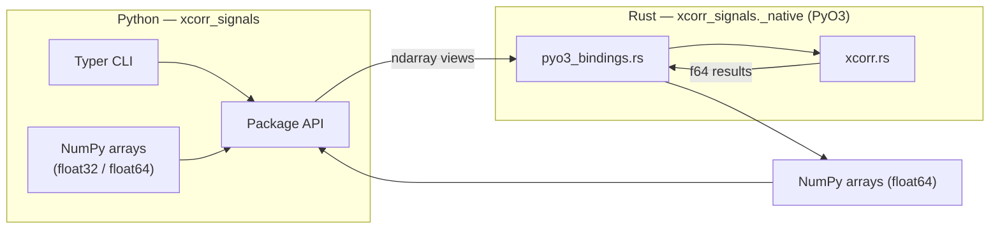
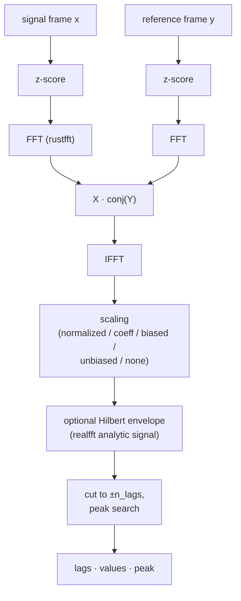

`xcorr-signals` is a Python package with a compiled Rust core. Python owns the
API surface (Typer CLI, NumPy types); Rust owns every per-sample computation.

## Pipeline

Both delay modes share one correlation pipeline per channel:

Details that matter for correctness:

- **Zero padding.** The FFT length is the next power of two ≥ 2n−1, so the
  circular convolution does not wrap: the peak at lag 0 sits at index
  `tau0 = n−1`, lag +k at `tau0+k`, lag −k at `tau0−k`.
- **Hilbert envelope.** Implemented with `realfft`: the analytic-signal
  magnitude $\sqrt{x^2 + H(x)^2}$ replaces the raw correlation, giving smooth
  envelopes for oscillatory signals. `realfft`'s inverse transform is
  unnormalized, so the Hilbert transform is divided by $N$.
- **Channel handling.** Channels are correlated independently and averaged,
  matching the reference implementation.

## Delay modes

| Mode | Function | Strategy | Result |
| ---- | -------- | -------- | ------ |
| 1 | `determine_delay_vs_time_py` | Per-frame xcorr, peak per frame, reliability filter | Frame delays + reliable indices |
| 2 | `determine_delay_from_average_py` | Average xcorr over all frames, single peak | One delay value |

Mode 1 resolves time-varying delays and exposes the full per-frame
correlation for percentile analysis; mode 2 gives one robust value when the
delay is constant.

## Data types

The Rust core computes exclusively in `f64`. The binding layer accepts
float32 and float64 NumPy arrays and converts once at the boundary — a single
implementation, and f64 accumulation for numerical robustness. Outputs are
always float64.

## Module map

| Module | Responsibility |
| ------ | -------------- |
| `src/xcorr_signals/src/xcorr.rs` | Correlation, scaling, Hilbert envelope, delay modes, unit tests |
| `src/xcorr_signals/src/pyo3_bindings.rs` | NumPy conversion, scaling parsing, `#[pyclass]` result types |
| `src/xcorr_signals/cli/` | Typer app, argument definitions, command stubs |
| `scripts/gen_examples.py` | Deterministic example figures for these docs |
