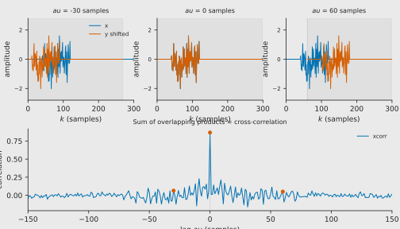
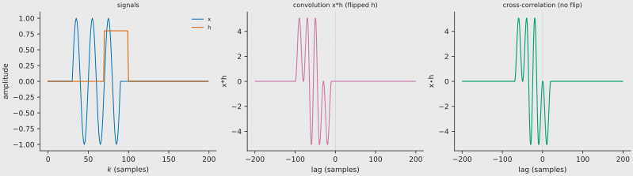
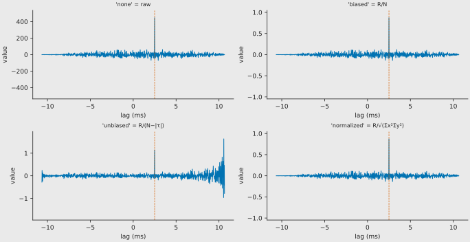

In signal processing, cross-correlation is a measure of similarity of two
series as a function of the displacement of one relative to the other. It is
the tool that turns a pair of audio waveforms into a single number — the delay
— at every point in time.

## Continuous definition

For continuous functions $x(t)$ and $y(t)$ the cross-correlation is

$$
R_{xy}(\tau) \;\triangleq\; \int_{-\infty}^{\infty} \overline{x(t)}\,y(t+\tau)\,dt
$$

which is equivalent to

$$
R_{xy}(\tau) \;\triangleq\; \int_{-\infty}^{\infty} \overline{x(t-\tau)}\,y(t)\,dt
$$

The bar denotes the complex conjugate (omitted for real signals). The lag
$\tau$ is the amount by which $y$ must be shifted so that it best matches
$x$.

## Discrete definition

For sampled signals of length $N$

$$
R_{xy}[k] \;\triangleq\; \sum_{n=-\infty}^{\infty} \overline{x[n]}\,y[n+k]
$$

In practice the sum runs over the overlapping samples only. This is exactly
a **sliding dot product**: at each lag $k$ the two signals are multiplied
sample-by-sample and summed.

*Top row:* the test burst (blue) and the same burst shifted by $-30$, $0$, and
$+60$ samples (orange). Shaded regions mark the overlapping interval.
*Bottom row:* the cross-correlation function. The value at each lag is the sum
of products inside the overlap.

## Properties

For real signals the cross-correlation satisfies three useful inequalities
(all proven directly from the Cauchy–Schwarz inequality):

- **Maximum at lag 0** (autocorrelation):  $\varphi_{xx}(0) = E_x$ (signal energy).
- **Bounded**:  $|\varphi_{xy}(\tau)| \le \sqrt{\varphi_{xx}(0)\,\varphi_{yy}(0)}$.
- **Even symmetry** (autocorrelation):  $\varphi_{xx}(-\tau) = \varphi_{xx}(\tau)$.

## Wiener–Khinchin (deterministic form)

The autocorrelation and the **energy density spectrum** are a Fourier pair:

$$
\varphi_{xx}(\tau) \;\xleftrightarrow{\;\mathcal{F}\;}\; |X(f)|^{2}
$$

This is the bridge between "shape matching" in the time domain and spectral
content in the frequency domain. For random (power) signals the same theorem
holds with autocorrelation replaced by its time average and the energy spectrum
replaced by the **power spectral density** (PSD).

## Relation to convolution

Cross-correlation looks like convolution, but **without flipping** the second
signal. The two operations are related by a time-reversal and conjugation:

$$
(x \star y)(t) \;=\; \overline{x(-t)} * y(t)
\;=\; \int_{-\infty}^{\infty} \overline{x(\tau)}\,y(t+\tau)\,d\tau
$$

If $x$ is real the conjugate disappears and the relation simplifies to the
time-reversal identity shown in the figure below.

In the frequency domain the point-wise spectrum multiplication carries the
conjugate on the second factor:

$$
\mathcal{F}\{x \star y\}(\omega) \;=\; X(\omega)\,\overline{Y(\omega)}
$$

*Left:* signals $x$ (blue) and $h$ (orange). *Middle:* convolution $x*h$
with $h$ flipped. *Right:* cross-correlation $x \star h$ with $h$ simply
shifted. The peak location is different because the flip changes the sign of
the lag.

## Scaling options

Raw cross-correlation values depend on signal length and amplitude. Five
normalisation modes are supported — exactly the same set used by
**elephant** (`scaleopt`) and MATLAB (`xcorr(..., scaleopt)`):

| Mode | Symbolic form | Effect |
| ---- | -------------- | ------ |
| **none** | — | Raw sum of products.  Values grow with $N$ and with signal power. |
| **biased** | $R_{xy}[k] / N$ | Divides by the number of samples.  Suppresses edge peaks but biases the estimate. |
| **unbiased** | $R_{xy}[k] / (N - | k |
| **coeff** | $R_{xy}[k] / \sqrt{\Sigma_x \Sigma_y}$ | Normalises by the geometric mean of the energies so that the autocorrelation at lag 0 equals 1. |

<!-- markdownlint-disable-next-line MD013 -->
| **normalized** | *same as coeff* | In `xcorr_signals` **coeff** and **normalized** share the same implementation, matching elephant's treatment of the two keywords as synonyms. |

> **Verified against elephant source code** (NeuralEnsemble/elephant,
> `signal_processing.py`): elephant uses the identical formulas — `biased`
> divides by $N$, `unbiased` by $N - |k|$, and both `coeff` and `normalized`
> divide by $\sqrt{(x^2_\mathrm{sum})(y^2_\mathrm{sum})}$. Both packages
> also **z-score** the inputs before correlation.

*Top-left:* raw values are ~500. *Top-right:* biased brings them to ~1.
*Bottom-left:* unbiased keeps the centre at ~1 but magnifies noise at the
edges. *Bottom-right:* normalized/coeff fixes the central peak at exactly 1.

## Why the peak is the delay

If $y[n] = x[n - k_0] + \text{noise}$, the cross-correlation satisfies

$$
\arg\max_\tau R_{xy}(\tau) \;\approx\; k_0
$$

because the shifted copy aligns perfectly at $\tau = k_0$. This is the
principle behind every delay-estimation command in the CLI.

## FFT computation and zero-padding

A naive $O(N^2)$ sliding-dot-product sum is too slow for long audio. The
FFT turns the operation into $O(N \log N)$:

1. Pad both signals to the next power of two $\ge 2N - 1$.
2. FFT both padded arrays.
3. Multiply the first spectrum by the complex conjugate of the second.
4. Inverse-FFT and remap the circular lags to a linear lag axis.

**Zero-padding is essential.** Without it the inverse FFT produces *circular*
cross-correlation, where the tail of one signal wraps around and corrupts the
beginning of the result. `xcorr_signals` pads automatically to the smallest
power of two $\ge 2N - 1$ so the output is a true **linear**
cross-correlation.

## References

- Wikipedia, *Cross-correlation* — [https://en.wikipedia.org/wiki/Cross-correlation](https://en.wikipedia.org/wiki/Cross-correlation)
- Wikipedia, *Convolution* — [https://en.wikipedia.org/wiki/Convolution](https://en.wikipedia.org/wiki/Convolution)
- Hanus, R. (2019). *Time delay estimation of random signals using cross-correlation with Hilbert Transform*. Measurement, 144, 67–74.
  DOI [10.1016/j.measurement.2019.07.014](https://doi.org/10.1016/j.measurement.2019.07.014)
- NeuralEnsemble/elephant `cross_correlation_function` source —
  [https://github.com/NeuralEnsemble/elephant/blob/master/elephant/signal_processing.py](https://github.com/NeuralEnsemble/elephant/blob/master/elephant/signal_processing.py)
