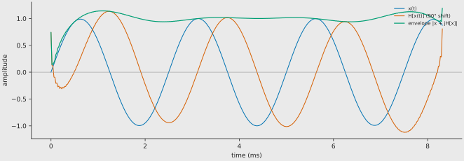
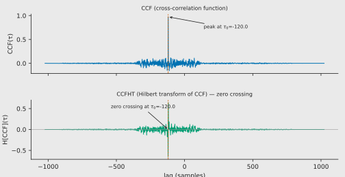

The Hilbert transform turns a real signal into its 90° phase-shifted partner.
Together they form the **analytic signal**, whose magnitude is the **envelope**
of the original. In `xcorr_signals` the envelope is applied to the
cross-correlation function (CCF), producing a smoother peak that is easier to
localise — especially when the CCF is noisy or oscillatory.

## Definition

For a real signal $x(t)$ the Hilbert transform is the principal-value
convolution

$$
\mathcal{H}[x](t) \;=\; \frac{1}{\pi}\;\mathrm{p.v.}\!\int_{-\infty}^{\infty}
\frac{x(\tau)}{t - \tau}\,d\tau
$$

In the frequency domain the transform is a pure phase shift:

$$
\mathcal{F}\{\mathcal{H}[x]\}(\omega) \;=\; -i\,\mathrm{sgn}(\omega)\;
\mathcal{F}\{x\}(\omega)
$$

- Positive frequencies are shifted by $-90°$ ($-i$).
- Negative frequencies are shifted by $+90°$ ($+i$).
- DC ($\omega = 0$) is zeroed.

In spectral terms the Hilbert operator multiplies the positive-frequency
lobe of $X(f)$ by $-j$ and the negative-frequency lobe by $+j$, leaving
the magnitude unchanged. This sign discrimination is what makes the
Hilbert transform indispensable for **single-sideband (SSB) modulation**:
by removing one spectral sideband, SSB halves the transmission bandwidth
without losing information.

Applying the transform twice returns the negative original:
$\mathcal{H}\{\mathcal{H}[x]\} = -x$.

## Analytic signal and envelope

The **analytic signal** is the complex combination

$$
x_a(t) \;=\; x(t) + i\,\mathcal{H}[x](t)
$$

Its magnitude is the **instantaneous envelope**:

$$
|x_a(t)| \;=\; \sqrt{x(t)^2 + \mathcal{H}[x](t)^2}
$$

*Blue:* $x(t) = \sin(2\pi f_0 t)$. *Orange:* $\mathcal{H}[x](t) = -\cos(2\pi f_0 t)$
(90° lag).  *Green:* envelope $|x_a(t)| = 1$, the constant amplitude of a
pure tone.

## Envelope of the cross-correlation function

In `xcorr_signals` the envelope is computed **after** scaling, on the CCF
itself, not on the raw audio. Why? The CCF of a narrow-band or oscillatory
signal can show ringing side-lobes. The envelope collapses those side-lobes
into a single smooth bump, giving a more robust delay estimate.

The Hilbert envelope is toggled with the `hilbert_envelope` flag in both the
Python API and the CLI.

## CCFHT — the zero-crossing method (Hanus 2019)

Hanus (2019) introduced the **CCFHT**: take the Hilbert transform of the
CCF and look for the **zero crossing** instead of the peak.

The idea is simple: because the CCF is real and even-like around its maximum,
its Hilbert transform is an odd-like function that passes through zero at the
exact lag of the CCF peak. A zero crossing is often easier to locate
numerically than a noisy maximum, and Hanus showed that the CCFHT method
yields **better standard uncertainty** than plain CCF for most SNR levels
($0.01 \le \text{SNR} \le 100$). Only at extremely low SNR ($\approx 0.01$)
with very few samples ($\approx 5000$) does the plain CCF win.

*Top:* CCF peak at $\tau_0 = -120$ samples. *Bottom:* CCFHT zero crossing at
the same $\tau_0 = -120$ samples. The vertical dashed line marks the
transport delay.

## Implementation in xcorr_signals

The crate uses the **real Hilbert transform** via `realfft`:

1. FFT the real CCF into a half-complex spectrum.
2. Multiply positive frequencies by $-i$ and negative frequencies by $+i$
   (equivalent to the $-i\,\mathrm{sgn}(\omega)$ filter).
3. Inverse real FFT back to a real signal.
4. Compute the envelope $\sqrt{\text{CCF}^2 + \mathcal{H}[\text{CCF}]^2}$.

Because the input to the Hilbert step is already the CCF (a real 1-D array),
a real-to-complex FFT avoids the overhead of a full complex transform.

> **Note:** The elephant library applies the same post-xcorr envelope (using
> `scipy.signal.hilbert`), but on the full complex analytic signal rather than
> the real-only path. The mathematical result is identical.

## References

- Wikipedia, *Hilbert transform* — [https://en.wikipedia.org/wiki/Hilbert_transform](https://en.wikipedia.org/wiki/Hilbert_transform)
- Hanus, R. (2019). *Time delay estimation of random signals using cross-correlation with Hilbert Transform*. Measurement, 144, 67–74.
  DOI [10.1016/j.measurement.2019.07.014](https://doi.org/10.1016/j.measurement.2019.07.014)
- NeuralEnsemble/elephant `cross_correlation_function` source —
  [https://github.com/NeuralEnsemble/elephant/blob/master/elephant/signal_processing.py](https://github.com/NeuralEnsemble/elephant/blob/master/elephant/signal_processing.py)
