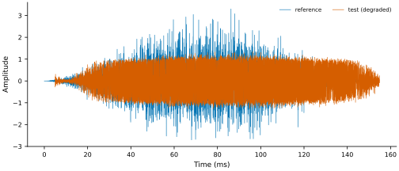
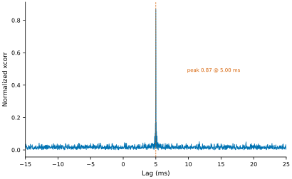
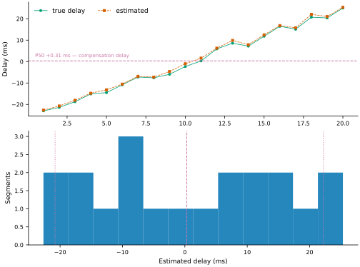

All examples run at $f_s = 48\;\mathrm{kHz}$ on deterministic noise bursts.
The test signals are degraded — soft-clip distortion plus noise at
22–28 dB SNR, and per-segment linear-phase FIR filtering — so correlation
peaks stay clearly below 100 %, as with real recordings. Regenerate every
figure with `uv run scripts/gen_examples.py`.

## Signal degradation

The test burst (orange) is soft-clipped, band-limited, and noisy compared to
the clean reference (blue):



## Average xcorr

Mode 2 on a single degraded burst delayed by 5 ms: the normalized
**Hilbert-envelope** correlation peaks at 87 % — below 100 % because part of
the signal energy is distortion and noise.  Using the envelope instead of
the raw CCF removes ringing side-lobes and produces a single clean peak that
is easier to locate:



## XCorr vs time

Mode 1 over 20 segments of 200 ms, one burst each, jittered by
$\pm 30\;\mathrm{ms}$.  Each segment uses a different burst, SNR, and FIR
length, so the correlation ridge wanders with the jitter while peak heights
vary with degradation.  The **Hilbert envelope** keeps the ridge sharp:


The same data as a 3D surface:


## Percentile analysis

Per-frame peaks stay below 100 %; all 20 frames pass a 0.3 reliability
threshold. Delay error against the true jitter shows three clusters — the
16/32/63-sample group delays of the per-segment FIR filters. Percentiles
quantify this systematic bias:

| Statistic | Value |
| --------- | ----- |
| P5 | +0.333 ms |
| P50 | +0.667 ms |
| P95 | +1.313 ms |
| max \|error\| | 1.313 ms |



The jitter itself (up to $\pm 30\;\mathrm{ms}$) is recovered exactly; what
remains is the filter group delay — visible only because the noise-burst
signals resolve single-sample peaks.

## Reproduce

The generator lives in `scripts/gen_examples.py`; figures are committed
under `docs/assets/images/` and rebuilt only on demand. Common constants:

```python
FS = 48_000          # sampling rate for all examples
B_SEGMENTS = 20      # delay-vs-time scenario: 20 segments
B_JITTER_S = 0.030   # ... jittered by +/- 30 ms
B_BURST_S = 0.120    # 120 ms noise burst per segment
```
