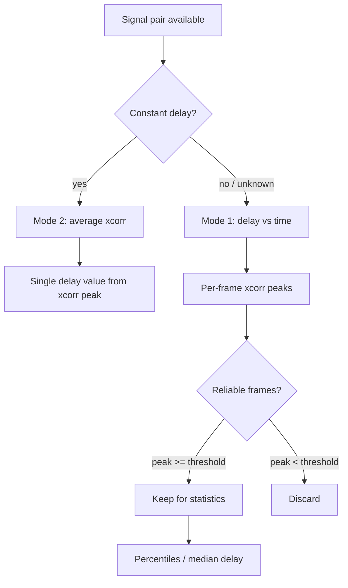

Pick the mode by asking whether the delay can change over time:



## Mode 1 — delay vs time

Frame the test signal, correlate each frame against the same frame of the
reference, and track the peak lag per frame:

```python
from xcorr_signals import determine_delay_vs_time_py

result = determine_delay_vs_time_py(
    test.reshape(-1, 1),   # (samples, channels), float32 or float64
    reference,
    frame_size=9600,       # 200 ms @ 48 kHz
    hop_size=9600,         # non-overlapping frames
    n_lags=1920,           # +/- 40 ms search window
    scaling="normalized",
    reliability_threshold=0.3,
)

# result.frames[c] is the frame list for signal channel c
est_ms = [f.lags[f.peak_index] / FS * 1000 for f in result.frames[0]]
kept = [est_ms[i] for i in result.reliable_indices[0]]
```

`result.frames[c][i].values` holds the correlation function of channel `c`,
frame `i`,
so you can plot an xcorr-over-time map or compute percentile statistics with
NumPy:

```python
import numpy as np

errors = np.array(est_ms) - true_ms
p5, p50, p95 = np.percentile(errors, [5, 50, 95])
```

## Mode 2 — delay from average xcorr

When the delay is constant, averaging the correlation over the whole signal
sharpens the peak before reading it:

```python
from xcorr_signals import determine_delay_from_average_py

delay = determine_delay_from_average_py(
    test.reshape(-1, 1),
    reference,
    frame_size=len(test),   # one frame = whole signal
    hop_size=len(test),
    scaling="normalized",
)   # array of shape (channels,) — one delay per signal channel
```

## Parameters

| Parameter | Guidance |
| --------- | -------- |
| `frame_size` | Long enough to capture the slowest signal feature; 100–200 ms works for speech-like bursts. |
| `hop_size` | `frame_size` for independent frames; smaller for overlapping, smoother tracks. |
| `n_lags` | Half the expected maximum delay plus margin; `None` searches the full range. |
| `scaling` | `normalized` for peak values interpretable as correlation coefficients; `unbiased` for amplitude-faithful decay. |
| `reliability_threshold` | Peak value a frame must reach to count as reliable; 0.3–0.5 for degraded audio. |

## Test signals

Use noise bursts with leading/trailing silence. A periodic tone
autocorrelates at every period, so its peak is ambiguous; a burst has exactly
one dominant peak per frame. Degradation (nonlinear distortion, band
limiting, noise above 25 dB SNR) lowers peaks below 100 % — see
[Examples](../examples/index.md) for a reproducible scenario.

## Multi-channel signals

All functions accept `(samples, channels)` test signals and correlate every
column against the reference. `xcorr()` returns values of shape
`(n_lags, channels)`; `determine_delay_from_average_py` returns one delay per
channel. To pick the dominant channel for a common time alignment (e.g.
binaural test against a single reference), use the helper:

```python
from xcorr_signals import determine_delay_multi_channel

best_delay, best_channel, peak = determine_delay_multi_channel(
    test,          # (samples, channels)
    reference,
    frame_size=9600,
    hop_size=9600,
)
```

Unequal signal/reference lengths are allowed — the shorter side is
zero-padded to the longer before correlating.
